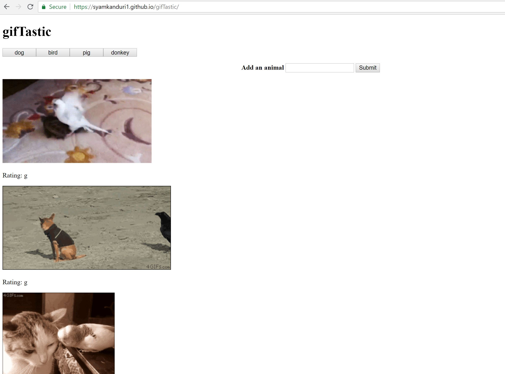

# gifTastic Game

<!-- Put the name of the project after the # -->
<!-- the # means h1  -->
# Homework # 6- gifTastic Game

<!-- Put a description of what the project is -->
To develop a small game using javascript, jQuery and html. 

# Link to deployed site
<!-- make a link to the deployed site --> 
<!-- [What the user will see](the link to the deployed site) -->
[my sixth homework](https://syamkanduri1.github.io/gifTastic/)


# Images
<!-- take a picture of the image and add it into the readme  -->
<!--  -->



# technology used
<!-- make a list of technology used -->
<!-- what you used for this web app, like html css -->

html, jQuery, javascript
<!-- 
1. First ordered list item
2. Another item
⋅⋅* Unordered sub-list. 
1. Actual numbers don't matter, just that it's a number
⋅⋅1. Ordered sub-list
4. And another item. 
-->


# code snippets
<!-- put snippets of code inside ``` ``` so it will look like code -->
<!-- if you want to put blockquotes use a > -->

```
Obtained animal images using api.giphy.com and made those animated or not depending on the click of each image.
    
    animalBtnsDiv.on("click", ".animal-btn", function (){
    var animalName = ($(this).attr("data-animalName")).replace(" ","+");
    queryURL = "https://api.giphy.com/v1/gifs/search?q=" + animalName + "&api_key=dc6zaTOxFJmzC&limit=10";
    console.log("queryURL ="+ queryURL);
    $.ajax({
          url: queryURL,
          method: "GET"
        })
        .then(function(response) {
          var results = response.data;
          for (var i = 0; i< results.length; i++){
              var rating = results[i].rating;
              var p = $("<p>").text("Rating: " + rating);
              var animalImage = $("");
              animalImage.attr("src", results[i].images.fixed_height_still.url);
              animalImage.attr("data-still", results[i].images.fixed_height_still.url);
              animalImage.attr("data-animate", results[i].images.fixed_height.url);
              animalImage.attr("data-state", "still");
              animalImage.attr("class", "gif");
              animalDiv.prepend(p);
              animalDiv.prepend(animalImage);
              $("#gifs-appear-here").prepend(animalDiv);
          }
        });
  });

```


# Learning points
<!-- Learning points where you would write what you thought was helpful -->
api.giphy.com is a new resource!

# Author 
Syam Kanduri

# License
Standard MIT License